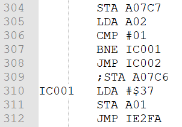
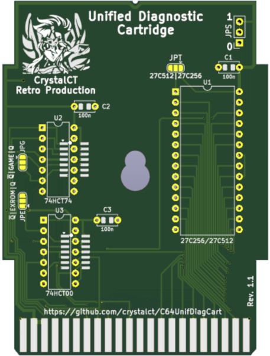

# C64 Unified Diagnostic Cartridge

The original Dead Test Diagnostic Cartridge is designed to test
the C64 and C128/C128D, (C64 Mode), Systems that fail
to display video information on Power Up even with the
C64 or C128/C128D Diagnostic Assembly installed.

The Dead Test is meant only as an extra troubleshooting
tool to assist the Technician in repairing Dead PCBs and
does not replace the current C64 or C128/C128D Diagnostic
Assemblies now being used.

The Dead Test is almost completely dedicated to System RAM
testing and does no type of System ROM or Port Testing.

The Dead Test is an Ultimax type cartridge that starts the Commodore 64 in that mode and not all areas of the RAM (64KByte) are accessible. Only the following locations were accessible:
* Zero Page Memory resides at locations $0000 - $00FF.
* The Stack Page resides at Memory locations $0100 - $01FF.
* RAM locations $0200 - $03FF.
* The Screen RAM resides at Memory locations $0400 - $07FF.
* The Color RAM resides at Memory locations $D800 - $DC00.
* RAM locations $0800 - $0FFF.

Due to the hardware configuration of the Commodore C64's DRAMs, all DRAMs come into play in the management of the first 4Kbytes of RAM ($0000 - $0FFF), so if at least one of the DRAM chips is not functioning correctly, the test carried out by Dead Test will highlight the problem.

When the Dead Test does not detect system malfunctions, it is notorious for changing the type of diagnostics, and therefore the type of cartridge, for a more in-depth analysis.

The <b>C64 Unified Diagnostic Cartridge</b> simplifies and automatically unifies this procedure in one single cartrdige. It starts the Commodore 64 in Ultimax mode, executing the code present in a portion of memory (Eprom or FlashRom) of the cartridge, 16Kbytes large, in particular the second 8Kbytes. In this memory area there must be the code of a Dead Test (but DesTestMax can also be fine) appropriately modified.

The modification consists in carrying out only a complete cycle of Dead Test analysis and then making sure that the type of cartridge changes automatically by switching from Ultimax mode to Standard mode, accessing the $DE00 location, and then doing a soft reset of the system. By changing the mode, the first 8KBytes of the cartridge will be executed as a standard cartridge, it follows that the code of a complete analysis and test cartridge must be present in the first 8KBytes. The soft reset will be the trigger for the start of the latter.

**Original Dead Test Mod**

How was the original Dead Test modified by worldofjani.com?
It was identified in the source assembly as the point at which the increment of the full test cycle count occurs, and then a check was added to see if the second cycle was starting, and at that point a jump to an additional piece of code copying the cartridge type change routine plus softreset, in RAM area $0334.
|Original 781220| Mod (Cycle control)|Mod (routine)|
|:---:|:---:|:---:|
||||

**Appeareance**

|||
|:---:|:---:|
|||

